## General tips

### How to figure out where the workspace is running on che.openshift.io?

You can query the OpenShift API on che.openshift.io for user metadata, including the URL of the OpenShift cluster where your workspaces will run. The following **curl** commands extract this URL using **username** or **email** as a parameter, where **username** or **email** are what the user used to login onto che.openshift.io:

curl -sgSL "https://api.openshift.io/api/users?filter[username]=<username>" | jq -r ".data[0].attributes.cluster"

Or

curl -sgSL "https://api.openshift.io/api/users?filter[email]=<email>" | jq -r ".data[0].attributes.cluster"

The result of the request will be the OpenShift Online cluster URL, for example [https://api.starter-us-east-2.openshift.com/](https://api.starter-us-east-2.openshift.com/)

Once the user logs in to the Openshift Console underlying cluster with his openshift.io login, he will get read only access in the **<username>-che** namespace where all workspace related pods are created.

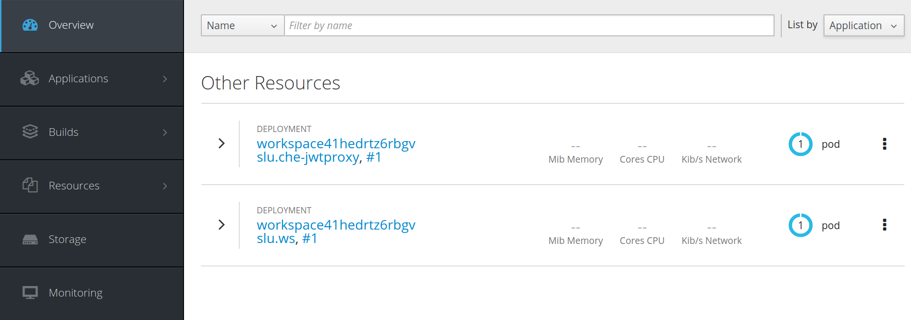

### Which logs are interesting and where to find them

There are few places which are useful to check logs. In Applications -> Pods view should be a list of active workspaces:

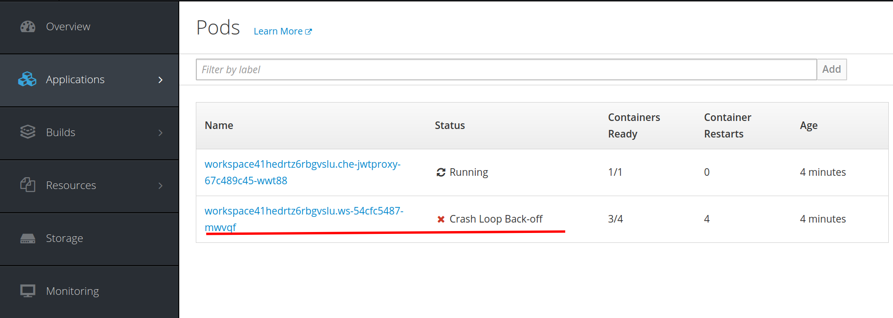

The pod where the workspace is running contains the information about all containers:

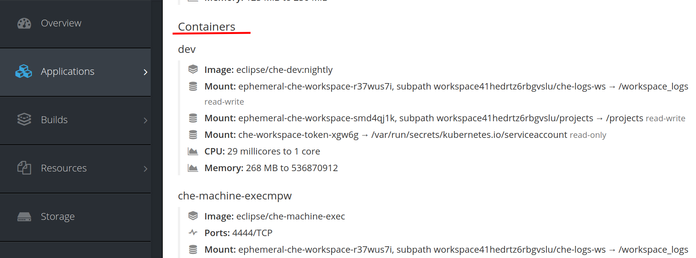

To check the logs of each of them you need to go to Logs section. Most interesting and useful logs are in the theia-ide container and in plugins containers. Here, for example we are looking at the output log of the sidecar container running the Java plugin:

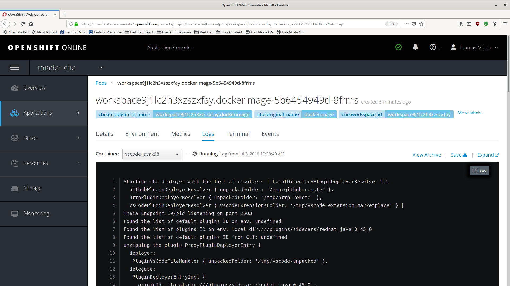

### Detecting memory problems

The most often frequent problems are about a plugin running out of memory. Here we have two cases:

* The plugin container runs out of memory. This can happen during plugin initialization when the container doesn't have enough RAM to execute the entrypoint of the image. This can be detected in logs of plugin's container. In this case the logs should contain something like OOMKilled. It is a sign that the processes in the container requested more memory than what is available in the container.
* Some process inside the container runs out of memory without the container itself noticing. For example, the java language server (jdt.ls, started by the vscode-java extension) could throw an OutOfMemoryException. This can happen any time after the container was initialized, for example when a plugin starts a language server or when a process runs out of memory because of the size of the project it has to handle. There is no common way to detect this problem. The best practice is to check logs of main process which should be run in the container, for example, the log file of JDT.LS (see the plugin-specific sections below)

### What to include in a bug report

Here is the list of things which should be present in the bug report:

* Base description of the problem and steps to reproduce it
* Workspace configuration. 
This information can be copied from the “Config” tab in the Che dashboard. It contains all needed information about which plugins are being used in the workspace
* Logs of the theia-ide and plugin containers
* Which platform che is running on (e.g. minikube, minishift, openshift) and the platform version 
* Web browser console logs
* If steps to reproduce are hard to give, a video might help us reproduce the problem. 

### **How to** **log the client-server traffic for debug adapters**

It is possible to log the exchange between Theia and a debug adapter into the **Output** view. This can be configured through the IDE Preferences: 

* File -> Settings -> Open Preferences
* Expand the **Debug** section in Preferences view 
* Set the “trace” preference value to “true”  (default is “false”) 

This will log all the communication events . In order to watch these events a user has to open **View -> Output** and select **Debug adapters** in drop-down selection list at the top-right corner of the **Output** view (note that a debug session must be started in order to **Debug adapters** selection appear in the list).

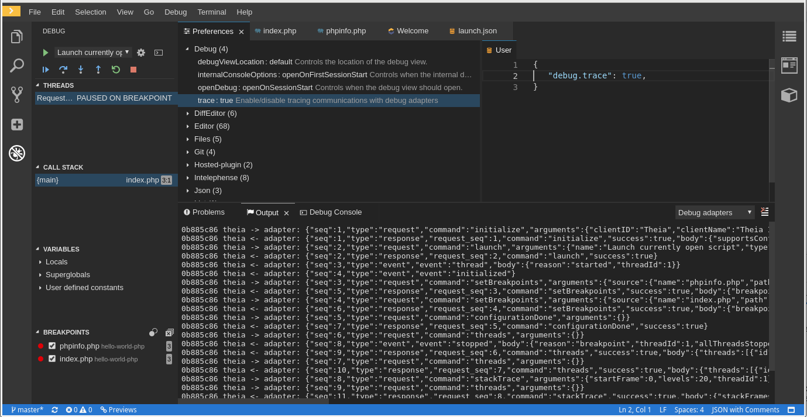

## Python

### Viewing logs

To check the logs go to Output view and select Python in the dropdown list.

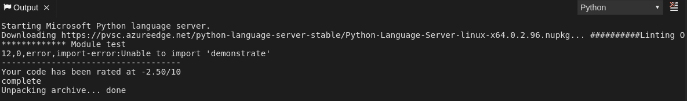

## C++

### Viewing the logs
To view the logs, navigate to the Output view and select Clang Language Server in the drop-down list.

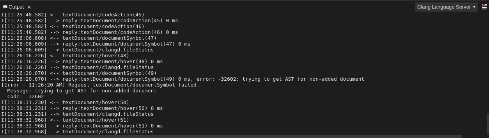

### Enabling the language server protocol (LSP) performance tracing
To enable performance tracing the clang server, in the Preferences view, use the clangd.trace to name a file that clangd should log a performance trace to, in chrome trace-viewer JSON format. Use this to diagnose the server issues. 

## Go

### Finding the Gopath

To check where GOPATH points to use the Go: Current GOPATH command.
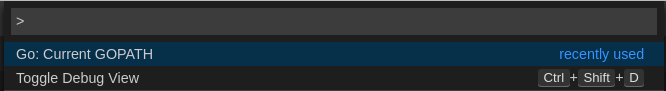

### Debug Console Log

To show log output from the debugger set showLog to true in a debug configuration.

{

  "version": "0.2.0",

  "configurations": [

     {
        "type": "go",

        "showLog": true

       ....

     }

  ]

}

The debug console will print additional information in the debug console:

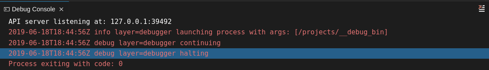

Besides showing logs from the debugger layer you can enable debugging output for a component by adding the package to the comma-separated list value of the logOutput attribute

{

  "version": "0.2.0",

  "configurations": [

     {

        "type": "go",

        "showLog": true,
        "logOutput": "debugger,rpc,gdbwire,lldbout,debuglineerr"

       ....

     }

  ]

}

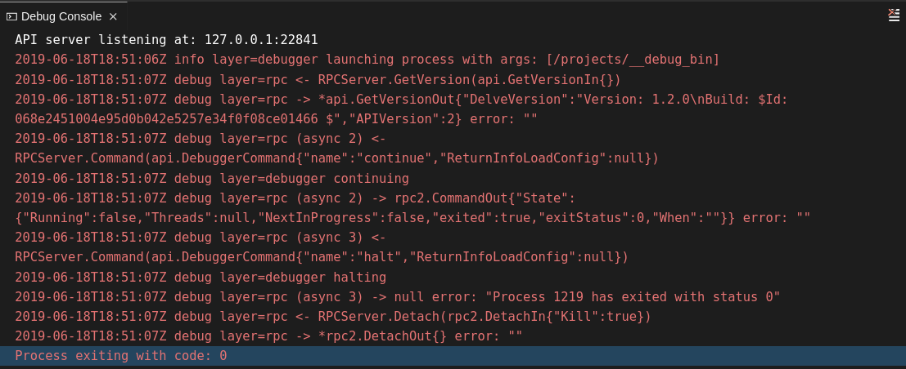

### Viewing Output Panel

To check the logs go to the Output view and select Go in the dropdown list.

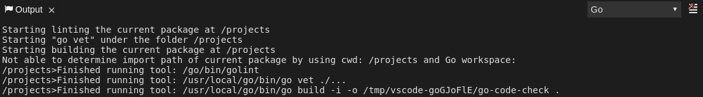

## NodeDebug NodeDebug2

There aren’t any specific diagnostics besides the general ones.

## Typescript

### LSP Tracing

To enable tracing of messages sent to the TS server set typescript.tsserver.trace to verbose in preferences. This trace can be used to diagnose TS Server issues. 

To enable logging of TS server to a file set typescript.tsserver.log to verbose. This log can be used to diagnose TS Server issues. The log may contain file paths. 

### Language Server Log

To open log file use Open TS Server log command.

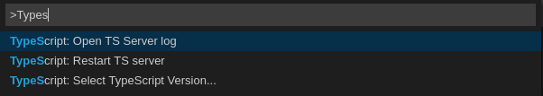

Additionally, you can figure out the path to the log file by checking the Typescript output console:
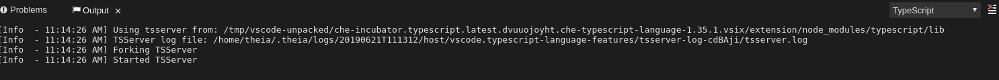

### Viewing Output Panel

To check the logs go to the Output view and select TypeScript in the dropdown list.

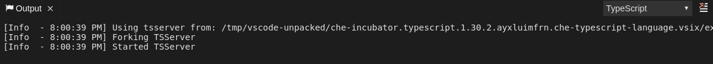

## Java 

Outside of the general diagnostics, there are a few [Language Support for Java(JDT.LS)](https://github.com/redhat-developer/vscode-java) plugin actions you can take:

### Verify jdt.ls is Running

Check if the container running JDT.LS plugin is running JDT.LS main process. For this, open a terminal in that container which is running JDT.LS plugin (the name of the container would be something like “vscode-javaxxx”). Inside of the terminal run ps aux | grep jdt to check if jdt.ls process is running in the container. If the process is running, the output should be something like usr/lib/jvm/default-jvm/bin/java --add-modules=ALL-SYSTEM --add-opens java.base/java.util... also this message should contain information about which VSCode java extension is used. If it isn't running, then the language server itself has not been started inside the container: you’ll need to check all logs described above in General tips.

### Verify jdt.ls features

If the JDT.LS process is running, check whether the Language Server features are working. For this, open a java file and try to use hover or autocompletion. You should also be able to see Java in the Outline view or problems view if you have an error in your file.

### Language Server Log

JDT.LS has own workspace where it logs errors, information about executed commands and events. To open this log file need to open a terminal in that container which is running JDT.LS plugin and execute cat <PATH_TO_LOG_FILE> where PATH_TO_LOG_FILE is /home/theia/.theia/workspace-storage/<workspace_name>/redhat.java/jdt_ws/.metadata/.log. Another way to view the log file is to run the  **Java: Open Java Language Server log file **command. 

### LSP Tracing

To log LSP messages to the VS Code output view, enable tracing by setting the java.trace.server to “verbose”.

There are also troubleshooting instructions on the [VS Code Java Github repo](https://github.com/redhat-developer/vscode-java#troubleshooting)

## Intelephense

### LSP Tracing

Besides the general diagnostics, PHP Intelephense Language Support can be configured to log the client-server interexchange into the **Output** view. This can be configured through **File -> Settings -> Open Preferences**. Once there, expand the **Intelephense** section and set the “trace.server.verbose” preference value to “verbose” (default value is “off”) in order to see all the communication events.

### Viewing Output Panel

To view these events navigate to **View -> Output** and select **Intelephense** in the drop-down selection list for the **Output** view.

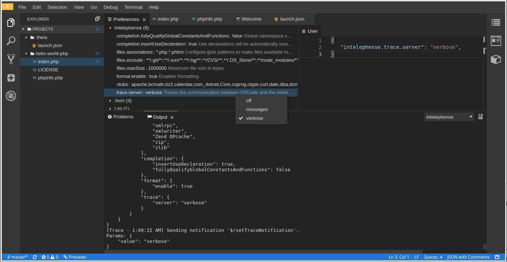

## PHP-Debug

### Viewing Logs

Besides the general diagnostics, the PHP Debug plugin can be configured to log the PHP Debug plugin diagnostic messages into **Debug Console** view. This can be configured before the start of debug session through “launch.json” by adding a ‘"log": true’ attribute to the selected launch configuration. In this case the diagnostic messages will be printed into the **Debug Console** view along with the application output.

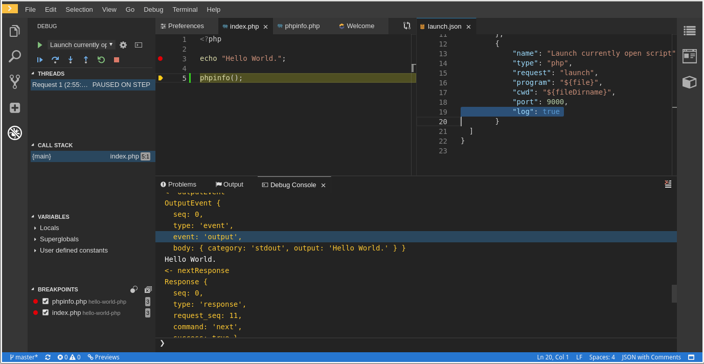

## XML

Outside of the general diagnostics, there a few XML plugin specific actions you can take:

### Verify XML Language Server is Running

First, open up a terminal in the container that is named ‘vscode-xml-xxx’. Once the terminal is open, type ‘ps aux | grep java’ and verify that the XML Language Server has started. You should see something like `java ***/org.eclipse.ls4xml-uber.jar`

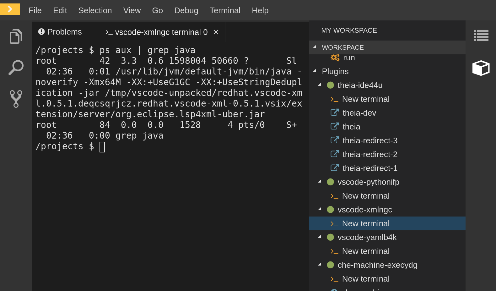

If it is not then please refer to the general tips.

### Check Feature Flags

First, you will need to check whether the features themselves are enabled. The XML plugin provides multiple settings that can enable and disable features such as:

	xml.format.enabled, xml.validation.enabled, xml.documentSymbols.enabled

These enable and disable the formatter, validation, and document symbols respectively. From here, the simplest way to diagnose whether the XML language server is working is to create a simple XML element such as `<hello></hello>` and see if it appears in the outline panel on the right. If there is no document symbols showing make sure that xml.documentSymbols.enabled is set to true. If it is true, and there are no symbols, then it looks like the language server was not hooked up to the editor. However, if there are document symbols then the language server is connected to the editor. From here, if any feature looks like it is not fully working, make sure it is set to true in the settings (they are true by default). If any of those features are not working, or not working as expected, then create an issue on the [Language Server itself](https://github.com/angelozerr/lsp4xml).

### LSP Tracing

To log LSP messages to the VS Code output view, enable tracing by setting the xml.trace.server to “verbose”.

### Language Server Log 

The log from the language server can be found in the plugin sidecar under the path /home/theia/.theia/workspace-storage/<workspace_name>/redhat.vscode-xml/lsp4xml.log

## YAML

Outside of the general diagnostics, there are a few YAML plugin specific actions you can take: 

### Verify the language server is running

First, you need to check if the container running the YAML plugin is running the YAML Language Server. To do this, inside of the editor open a terminal in the container that is running the YAML plugin. The name of the container will be “vscode-yaml-xxx”. Next, inside of the terminal run `ps aux | grep node`, this will look for all node processes running in the current container. After that, verify that a command such as `node ********/server.js` is running.

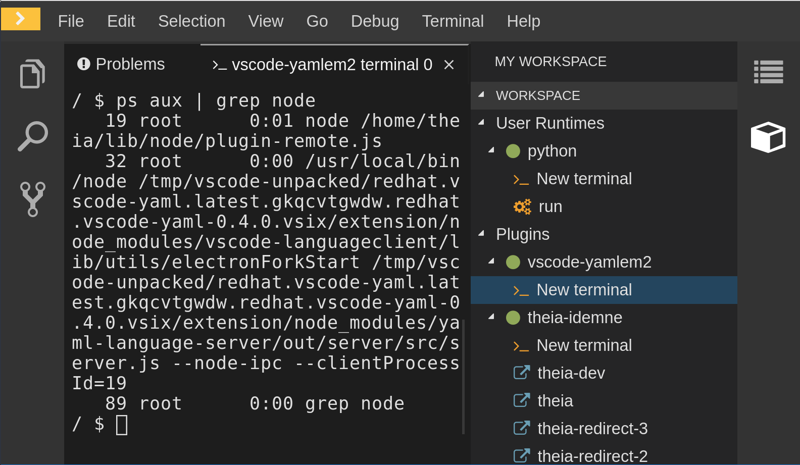

After running that command if something like `node ********/server.js` is running inside of the container, then that means the language server itself is running. If it is not running then the language server itself has not been started inside the container. In this case, refer to general tips.

### Check Feature Flags

If the language server IS running, you will need to check whether the features themselves are enabled. The YAML plugin provides multiple settings that can enable and disable features such as:

	Yaml.format.enable, yaml.validate, yaml.hover, and yaml.completion

These enable and disable the formatter, validation, hover, and completion respectively. The simplest way to diagnose whether the plugin is working is to type in the simplest YAML you can think of such as `hello: world` and then open the Outline Panel on the right inside of the editor. Verify if there are any document symbols appearing. If there are then the language server is connected to the editor. If any feature looks like it is not working, make sure the settings listed above are set to true (they are true by default). From this point, if the language server was correctly hooked up, and their settings are true, If any the formatter, validation, hover or completion are not working, or not working as expected, then create an issue on the [Language Server itself](https://github.com/redhat-developer/yaml-language-server).

### LSP Tracing

To log LSP messages to the VS Code output view, enable tracing by setting the yaml.trace.server to “verbose”.

## Omnisharp

Che uses the Omnisharp Theia plug-in as a remote plug-in which is located in [https://github.com/redhat-developer/omnisharp-theia-plugin](https://github.com/redhat-developer/omnisharp-theia-plugin). It is currently at an early stage, so if you find any bugs please open an issue or contribute your fix into this repo. 

This plug-in registers [omnisharp-roslyn](https://github.com/OmniSharp/omnisharp-roslyn) as a language server and provides project dependencies and language syntax for C# applications.

The language server runs on Dotnet SDK v.2.2.105.

There a few things  to check if something doesn't work:

### Verify the language server is running

Check if the container running omnisharp-theia-plugin is running OmniSharp. To do this need to execute ps aux | grep OmniSharp.exe, if the process is running, the output should be something like /tmp/theia-unpacked/redhat-developer.che-omnisharp-plugin.0.0.1.zcpaqpczwb.omnisharp_theia_plugin.theia/server/bin/mono /tmp/theia-unpacked/redhat-developer.che-omnisharp-plugin.0.0.1.zcpaqpczwb.omnisharp_theia_plugin.theia/server/omnisharp/OmniSharp.exe -lsp. Otherwise the language server itself has not been started inside the container and you will need to check the logs described above in General tips.

### Check Features

If OmniSharp.exe process is running, check whether the Language Server features are working. For this, open a .cs file and try hover, completion features or open Problems or Outline view.

### View Output Panel

If Omnisharp.exe is running, it logs all information to the output panel. To view the logs, open the Output view and select C# from the dropdown.

## 

## Netcoredebug

Che uses a Netcoredbg Theia plug-in as a remote plug-in which is located in [https://github.com/redhat-developer/netcoredbg-theia-plugin](https://github.com/redhat-developer/netcoredbg-theia-plugin). It is at an early stage so if you find any bugs, please register a ticket or contribute your fix into this repo.

This plug-in provides [netcoredbg](https://github.com/Samsung/netcoredbg) which implements the VSCode Debug Adapter protocol and allows users to debug .NET apps under the .NET Core runtime.

Dotnet SDK v.2.2.105 is installed into the container where the Netcoredbg plug-in is ran.

### Verify if the Theia plugin was correctly initialized

The easiest way to test if the plugin has been correctly initialized is to see if there is a netcoredbg debug configuration inside of launch.json. This debug configuration should look like:

{

    "type": "netcoredbg",

    "request": "launch",

    "program": "${workspaceFolder}/bin/Debug/<target-framework>/<project-name.dll>",

    "args": [],

    "name": ".NET Core Launch (console)",

    "stopAtEntry": false,

    "console": "internalConsole"

}

To test whether it exists, try autocompletion inside of the braces of the “configuration” section of launch.json. If you can find netcoredbg then it was correctly initialized. If you cannot find it then it was not correctly initialized so please refer to the General tips.

### Viewing Logs

The debug console is the only location where you can find logs.

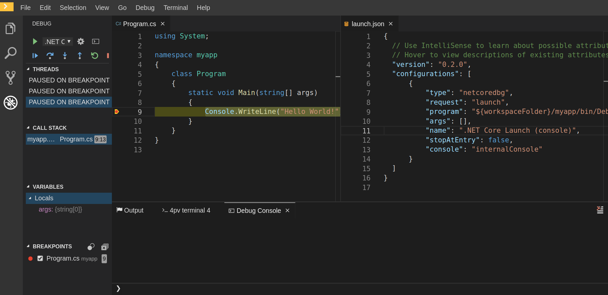

## Camel 

### Verify the language server is running

As with other language plugins, you can inspect the log output of the sidecar container running the Camel tooling; the Camel tooling container will be named something like “vscode-apache-camelxxx”.

Open a terminal inside of ‘vscode-apache-camelxxx’ and run ‘ps aux | grep java’. You should find a language server process similar to 

‘java -jar /tmp/vscode-unpacked/camel-tooling.vscode-apache-camel.latest.euqhbmepxd.camel-tooling.vscode-apache-camel-0.0.14.vsix/extension/jars/language-server.jar’

If you cannot find it then refer to the general tips section.

### Language Server Log 

The Camel language server is a Springboot application that writes its log to ${java.io.tmpdir}/log-camel-lsp.out. Typically, ${java.io.tmpdir} points to /tmp, so the filename would be /tmp/log-camel-lsp.out. 

### Viewing Output Panel

There can be an Output channel named “Language Support for Apache Camel”. Please note that it is created only at the first created log entry on client side. (so it can be normal that there are none when everything is going well)

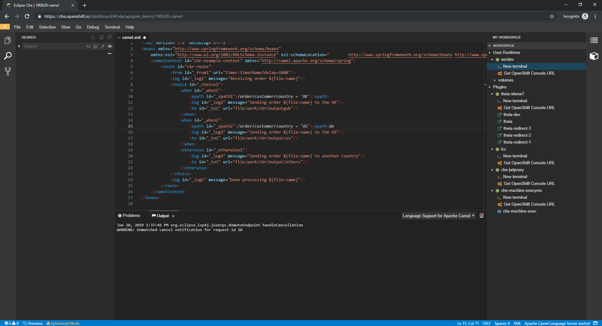

